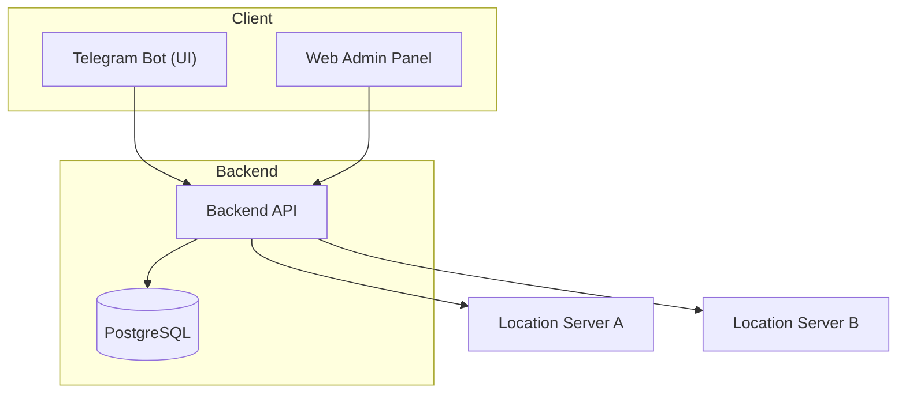
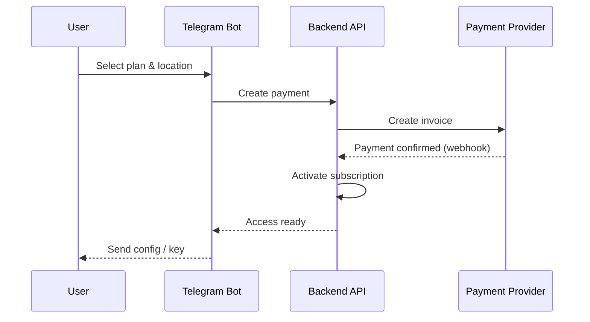

# 🚀 VPN Subscription Service

---

### C4 — Container Diagram



---

## 🔁 Main User Flow (Sequence)



---

## 🧰 Tech Stack

### Telegram Bot

* Python 3.11+
* aiogram 3.x
* Async architecture
* Inline keyboards with CallbackData

### Backend (planned)

* FastAPI
* PostgreSQL
* SQLAlchemy + Alembic
* REST API
* Webhooks

### Admin Panel (planned)

* SPA frontend
* Backend API integration
* Role-based access

---

## 📂 Repository Structure

```
app/
  bot/
docs/
  adr/
backend/        # planned
admin-panel/    # planned
main.py
README.md
```

---

## ✅ Project Status

### Implemented

* Telegram bot skeleton
* Menu system & user flows
* Role separation (user / admin)
* Logging and graceful shutdown
* PRD and ADR documentation

### Planned

* Backend API & database
* Subscription logic
* Payment integration
* Location servers
* Admin web panel
* Deployment & monitoring

---

## 🗺 Roadmap (High-Level)

1. Backend API + database
2. Bot ↔ Backend integration
3. Payments & subscriptions
4. Device management
5. Location support
6. Admin panel
7. Infrastructure & monitoring

---

## 📘 Documentation

Architecture decisions are documented using ADR:

* ADR-001 — Backend as Source of Truth
* ADR-002 — Subscription Model
* ADR-003 — Device Limits (+50₽)
* ADR-004 — Locations Architecture
* ADR-005 — Payments Approach
* ADR-006 — Web Admin Panel

See `/docs/adr`.

---

## ▶️ Local Bot Run

```bash
export BOT_TOKEN=your_bot_token
export SUPPORT_USERNAME=your_support_username
export ADMIN_TELEGRAM_IDS=123456789

python main.py
```

---

## 🎯 Project Goals

* Demonstrate architectural thinking
* Show product-oriented backend design
* Practice system decomposition
* Create a strong portfolio project

---

## 📄 License

Educational project. Use at your own discretion.

```

---

# 2️⃣ backend/README.md

```markdown
# Backend API

Backend service for VPN Subscription Service.  
Acts as the **single source of truth**.

---

## Responsibilities

- Users & profiles
- Subscription lifecycle
- Device management
- Payment processing
- Location orchestration
- Admin operations

---

## Planned Stack

- FastAPI
- PostgreSQL
- SQLAlchemy + Alembic
- REST API
- Webhooks

---

## Domain Model (High-Level)

- User
- Plan
- Subscription
- Device
- Payment
- Location
- AccessKey

---

## Key Principles

- Stateless API
- Explicit state transitions
- Backend-only business logic
- Clients are UI only

---

## API Consumers

- Telegram Bot
- Web Admin Panel

---

## Status

🚧 In active design / not implemented yet.
```

---

# 3️⃣ admin-panel/README.md

```markdown
# Admin Panel

Web-based administration panel for VPN Subscription Service.

---

## Purpose

Provide operators and admins with a convenient UI to:

- Manage users
- View and modify subscriptions
- Monitor payments
- Control devices and access keys
- Manage locations
- Perform manual operations (revoke, extend)

---

## Planned Features (v1)

- Authentication & roles
- Dashboard (active users, subscriptions)
- User management
- Subscription control
- Payment history
- Device & access management
- Audit log

---

## Planned Stack

- SPA frontend (React / Vue / similar)
- Backend API
- Role-based access

---

## Design Goals

- Fast access to critical actions
- Clear system state visibility
- Minimal operational friction

---

## Status

🚧 Planned / not implemented yet.
```
